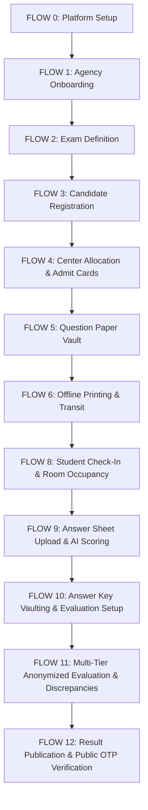

# ParikshaSetu — Sequential Master Testing Guide (Flows 0–12)

This testing guide provides step-by-step instructions to verify the entire implemented lifecycle of ParikshaSetu in sequence as specified in [03_app_flow.md](file:///c:/Users/Devraj/Desktop/ParikshaSetu/files/03_app_flow.md).

For each flow, you will find instructions for **Simultaneous Verification** (interacting via the frontend browser while observing backend logs and DB state) and **Backend-Only API Verification** (testing endpoints directly using PowerShell scripts).

---

## 1. Prerequisites & Host Setup

### Windows Hosts File Configuration
1. Open PowerShell or Command Prompt as **Administrator**.
2. Run: `notepad C:\Windows\System32\drivers\etc\hosts`
3. Append the following local DNS mapping at the bottom:
   ```text
   127.0.0.1    parikshasetu.localhost
   127.0.0.1    admin.localhost
   127.0.0.1    national-testing-agency.localhost
   127.0.0.1    delhi-center.portal.localhost
   ```
4. Save and close.

### Starting the Services
Open **three terminals** in `C:\Users\Devraj\Desktop\ParikshaSetu\`:

*   **Terminal 1 — FastAPI Backend Server:**
    ```powershell
    venv\Scripts\uvicorn apps.api.main:app --reload --host 0.0.0.0 --port 8000
    ```
*   **Terminal 2 — Celery Worker (Solo Pool for Windows):**
    ```powershell
    venv\Scripts\celery -A apps.api.workers.celery_app.celery_app worker --loglevel=info -P solo
    ```
*   **Terminal 3 — Next.js Frontend Server:**
    ```powershell
    cd apps\web
    npm run dev
    ```

### Supabase Storage Buckets
Ensure the following buckets exist in your Supabase Dashboard → **Storage**:
- `syllabus-pdfs` (Public or Scoped)
- `brochures` (Public)
- `admit-cards` (Private)
- `question-papers-vault` (Private)
- `answer-sheet-uploads` (Private)
- `result-pdfs` (Private)

---

## 2. Master Flow Sequence



---

## FLOW 0: Platform Setup (One-Time)
**Actor:** Platform Admin  
**Objective:** Access the admin portal to manage global settings and monitor the ledger.

### A. Simultaneous UI & Backend Verification
1. Navigate to: `http://admin.localhost:3000/login`
2. Log in using bypass credentials:
   - **Email**: `admin@parikshasetu.in`
   - **Secret Token**: `AdminPassword123`
3. Click the **Global Config** tab. Set:
   - *Visibility Score Threshold*: `8.0`
   - *Geofence Tolerance*: `100 meters`
   - Click **Commit Settings to Ledger**.
4. **Expected UI Result**: Card displays green update notification; config variables reflect new values on page reload.
5. **Expected Backend Logs (Terminal 1)**:
   ```
   INFO: GET /api/v1/admin/config 200 OK
   INFO: PUT /api/v1/admin/config 200 OK
   ```

### B. Backend-Only API Verification (PowerShell)
```powershell
$ADMIN_TOKEN = "your_admin_jwt" # If requiring JWT signature validation, else bypass header
$BASE = "http://localhost:8000/api/v1"

# 1. Fetch config settings
Invoke-RestMethod -Uri "$BASE/admin/config" -Method GET

# 2. Update config settings
$body = '{"default_visibility_threshold": 8.0, "default_geofence_radius_meters": 100, "watermark_master_key_ref": "WATERMARK_MASTER_KEY", "hsm_integration_mode": "Supabase Vault"}'
Invoke-RestMethod -Uri "$BASE/admin/config" -Method PUT -ContentType "application/json" -Body $body
```

---

## FLOW 1: Agency Registration & Onboarding
**Actor:** Agency Head & Platform Admin  
**Objective:** Register a new testing agency, approve it from the admin console, and invite staff.

### A. Simultaneous UI & Backend Verification
1. Navigate to: `http://parikshasetu.localhost:3000/agency/register`
2. Fill the form with name: `National Testing Agency` (this generates slug `national-testing-agency`), email: `head@nta.gov.in`, official PAN, etc., and click **Register**.
3. Log into the Admin panel (`http://admin.localhost:3000/`), select **Agencies** tab, find `National Testing Agency` in the pending drawer, and click **Approve**.
4. **Expected Celery Task (Terminal 2)**:
   ```
   [Celery] Sending welcome email to National Testing Agency...
   [Celery] Sending invitation email to National Testing Agency Head... Setup Link: http://national-testing-agency.localhost:3000/accept-invite?token=<token>
   ```
5. Copy the invite link from Terminal 2 log and paste it into the browser. Type a new password (e.g., `AgencyPassword123`) and submit.
6. Navigate to `http://national-testing-agency.localhost:3000/login` and sign in.
7. Go to **Staff Hierarchy** tab → Click **Invite Staff** → Invite a staff member with role `center_officer` (email: `delhi_officer@nta.gov.in`).
8. Copy their invite token from Celery log, accept invite, and register password.

### B. Backend-Only API Verification (PowerShell)
```powershell
# 1. Request registration
$regBody = '{"organization_name": "National Testing Agency", "official_email": "head@nta.gov.in", "phone": "9999988888", "pan_number": "ABCDE1234F", "address": "New Delhi", "city": "New Delhi", "state": "Delhi", "pincode": "110001"}'
$agency = Invoke-RestMethod -Uri "$BASE/agencies/register" -Method POST -ContentType "application/json" -Body $regBody
$AGENCY_ID = $agency.id

# 2. Approve agency (as platform admin)
Invoke-RestMethod -Uri "$BASE/admin/agencies/$AGENCY_ID/approve" -Method PATCH

# 3. Invite Staff (using the Agency Head token)
$HEAD_TOKEN = "paste_agency_head_jwt"
$inviteBody = '{"full_name": "Delhi Officer", "email": "delhi_officer@nta.gov.in", "phone": "9999977777", "role": "center_officer"}'
$inviteRes = Invoke-RestMethod -Uri "$BASE/agency/staff" -Method POST -Headers @{ "Authorization" = "Bearer $HEAD_TOKEN"; "Content-Type" = "application/json" } -Body $inviteBody
$INVITE_TOKEN = $inviteRes.invite_token

# 4. Accept Invitation & Set Password
$acceptBody = '{"invite_token": "' + $INVITE_TOKEN + '", "new_password": "OfficerPassword123"}'
Invoke-RestMethod -Uri "$BASE/agency/staff/accept-invite" -Method POST -ContentType "application/json" -Body $acceptBody
```

---

## FLOW 2: Exam Creation
**Actor:** Agency Head or Manager  
**Objective:** Define a new exam, register center and room layouts, generate the AI information brochure, and open registration.

### A. Simultaneous UI & Backend Verification
1. Logged into `national-testing-agency.localhost:3000` as Agency Head.
2. Navigate to **Examinations** → Click **New Examination**.
3. **Step 1 (Basic)**: Set Name `Engineering Entrance 2026`, Slug `ee-2026`, Mode `OFFLINE`, Seat Ceiling `10`, Registration Fee `500`.
4. **Step 2 (Eligibility)**: Min Age `17`, Max Age `25`.
5. **Step 3 (Syllabus)**: Enter "Mathematics, Physics, Chemistry".
6. **Step 4 (Centers & Rooms)**:
   - Add Center: Name `Delhi Central Academy`, Code `DEL-01`, City `New Delhi`.
   - Add Room in Center: Code `Room-1`, Seating Capacity `5`. Click **Register Center**.
7. Click **Save & Continue to Review** → Click **Go to Exam Workspace**.
8. **Expected Celery Task (Terminal 2)**:
   ```
   [Celery] Generating information brochure for exam Engineering Entrance 2026...
   ```
9. Click **Publish Exam Specs** (status shifts to `PUBLISHED`), then click **Open Registration Roster** (status shifts to `REGISTRATION_OPEN`).

### B. Backend-Only API Verification (PowerShell)
```powershell
# 1. Create Exam Draft
$examBody = '{
  "name": "Engineering Entrance 2026",
  "slug": "ee-2026",
  "mode": "OFFLINE",
  "exam_date": "2026-07-01",
  "start_time": "10:00:00",
  "duration_minutes": 180,
  "fee_inr": 500.0,
  "total_seats": 10,
  "eligibility_criteria": {"min_age": 17, "max_age": 25},
  "syllabus": "Mathematics, Physics, Chemistry"
}'
$exam = Invoke-RestMethod -Uri "$BASE/exams" -Method POST -Headers @{ "Authorization" = "Bearer $HEAD_TOKEN"; "Content-Type" = "application/json" } -Body $examBody
$EXAM_ID = $exam.id

# 2. Add Center
$centerBody = '{
  "name": "Delhi Central Academy",
  "center_code": "DEL-01",
  "address": "Connaught Place",
  "city": "New Delhi",
  "state": "Delhi",
  "pincode": "110001",
  "latitude": 28.6139,
  "longitude": 77.2090,
  "geofence_radius_meters": 100
}'
$center = Invoke-RestMethod -Uri "$BASE/exams/$EXAM_ID/centers" -Method POST -Headers @{ "Authorization" = "Bearer $HEAD_TOKEN"; "Content-Type" = "application/json" } -Body $centerBody
$CENTER_ID = $center.id

# 3. Add Room under Center
$roomBody = '{
  "room_code": "Room-1",
  "seating_capacity": 5
}'
Invoke-RestMethod -Uri "$BASE/centers/$CENTER_ID/rooms" -Method POST -Headers @{ "Authorization" = "Bearer $HEAD_TOKEN"; "Content-Type" = "application/json" } -Body $roomBody

# 4. Publish & Open Registration
Invoke-RestMethod -Uri "$BASE/exams/$EXAM_ID/publish" -Method POST -Headers @{ "Authorization" = "Bearer $HEAD_TOKEN" }
Invoke-RestMethod -Uri "$BASE/exams/$EXAM_ID/open-registration" -Method POST -Headers @{ "Authorization" = "Bearer $HEAD_TOKEN" }
```

---

## FLOW 3: Student Registration & Payment
**Actor:** Candidate  
**Objective:** Register a candidate profile, perform webcam face capture, select exam preferences, and complete a simulated checkout.

### A. Simultaneous UI & Backend Verification
1. Navigate to: `http://localhost:3000/student/register`
2. Fill profile form. Under **Webcam Photo**, click **Open Webcam** → **Capture Photo** (used for biometric hash) and submit registration.
3. Login at `http://localhost:3000/student/login`.
4. Locate `Engineering Entrance 2026` under upcoming exams, click **Register Now**.
5. Select Preference 1: `Delhi Central Academy` and click **Submit & Proceed to Payment**.
6. On checkout page, click the blue **Simulate payment (Dev Bypass)** button.
7. **Expected UI Result**: Displays success page showing application number (e.g., `LG-2026-00001`), status changes to `REGISTERED`.

### B. Backend-Only API Verification (PowerShell)
```powershell
# 1. Register student profile (Multipart Form)
# Note: Prepare a valid jpeg image file named 'student-photo.jpg' and pdf 'id-scan.pdf' locally
$photoFile = "C:\path\to\student-photo.jpg"
$idScanFile = "C:\path\to\id-scan.pdf"

$regForm = @{
  full_name = "Jane Candidate"
  email = "jane@student.com"
  password = "StudentPassword123"
  phone = "9888877777"
  date_of_birth = "2008-05-15"
  gender = "FEMALE"
  address = "Connaught Place"
  city = "New Delhi"
  state = "Delhi"
  pincode = "110001"
  id_proof_type = "AADHAAR"
  id_proof_number = "123456789012"
  photo = Get-Item $photoFile
  id_proof_scan = Get-Item $idScanFile
}
$studentRes = Invoke-RestMethod -Uri "$BASE/students/register" -Method POST -Form $regForm
$STUDENT_ID = $studentRes.student_id

# Student logs in via client-side Supabase Auth to retrieve their JWT (represented as $STUDENT_TOKEN below)
$STUDENT_TOKEN = "your_student_jwt"

# 2. Register for Exam (Select preferences)
$prefBody = '{"center_preference_1": "' + $CENTER_ID + '", "center_preference_2": "' + $CENTER_ID + '", "center_preference_3": "' + $CENTER_ID + '"}'
$regRes = Invoke-RestMethod -Uri "$BASE/exams/$EXAM_ID/registrations" -Method POST -Headers @{ "Authorization" = "Bearer $STUDENT_TOKEN"; "Content-Type" = "application/json" } -Body $prefBody
$REG_ID = $regRes.registration_id

# 3. Confirm Payment (Dev Bypass)
Invoke-RestMethod -Uri "$BASE/registrations/$REG_ID/payment/confirm" -Method POST -Headers @{ "Authorization" = "Bearer $STUDENT_TOKEN" }
```

---

## FLOW 4: Center Allocation & Admit Card Generation
**Actor:** Agency Head or Manager  
**Objective:** Close registrations, execute center allocation logic, generate admit card PDFs with signed QR payloads.

### A. Simultaneous UI & Backend Verification
1. Log into Agency Console, open the `Engineering Entrance 2026` workspace.
2. Click **Force Close Registration** (exam status changes to `REGISTRATION_CLOSED`).
3. Select the **Center Allocation** tab. Click **Run Center Allocation**.
4. **Expected UI Result**: Allocation graph and table displays showing Jane Candidate allocated to room `Room-1` in `Delhi Central Academy`.
5. Click **Generate & Issue Admit Cards**.
6. **Expected Celery Task (Terminal 2)**:
   ```
   [Celery] Generating admit card for student Jane Candidate...
   [Celery] PDF compiled and uploaded to storage. qr_payload_jwt signed successfully.
   ```
7. Log into candidate console (`http://localhost:3000/student/dashboard`), select the exam, and click **Download Admit Card** to view the PDF in the secure viewer.

### B. Backend-Only API Verification (PowerShell)
```powershell
# 1. Close registrations
Invoke-RestMethod -Uri "$BASE/exams/$EXAM_ID/close-registration" -Method POST -Headers @{ "Authorization" = "Bearer $HEAD_TOKEN" }

# 2. Run center allocation
Invoke-RestMethod -Uri "$BASE/exams/$EXAM_ID/allocate-centers" -Method POST -Headers @{ "Authorization" = "Bearer $HEAD_TOKEN" }

# 3. Generate admit cards
Invoke-RestMethod -Uri "$BASE/exams/$EXAM_ID/generate-admit-cards" -Method POST -Headers @{ "Authorization" = "Bearer $HEAD_TOKEN" }
```

---

## FLOW 5: Question Paper Vault
**Actor:** Paper Setter / Agency Officer  
**Objective:** Upload exam paper PDF inside a webcam-monitored browser session with automatic AES-256 encryption.

### A. Simultaneous UI & Backend Verification
1. Open the exam workspace and click the **🔒 Question Vault** tab.
2. Click **🔐 Start Monitored Upload Session**.
3. **Expected UI Result**: Pulsing green `● Session Active` badge appears, webcam feed is rendered in the panel.
4. Select your question paper PDF and click **Upload & Vault**.
5. **Expected UI Result**: Loader displays `Encrypting...`, followed by a success pop-up. The vaulted paper details and vault access log entries appear.
6. **Expected Supabase Checks**:
   - `question_papers` table: row has `status = VAULTED` and encryption keys starts with `vault:mock:` references.
   - Storage → `question-papers-vault` bucket contains encrypted file `[examId]/paper_v1.enc`.

### B. Backend-Only API Verification (PowerShell)
```powershell
# 1. Start monitored upload session
$session = Invoke-RestMethod -Uri "$BASE/exams/$EXAM_ID/papers/upload-session/start" -Method POST -Headers @{ "Authorization" = "Bearer $HEAD_TOKEN" }
$SESSION_TOKEN = $session.session_token

# 2. Upload paper (Multipart Form with PDF magic bytes verification)
$paperFile = "C:\path\to\question-paper.pdf"
$paperForm = @{
  file = Get-Item $paperFile
}
Invoke-RestMethod -Uri "$BASE/exams/$EXAM_ID/papers" -Method POST -Headers @{ "Authorization" = "Bearer $HEAD_TOKEN"; "X-Session-Token" = "$SESSION_TOKEN" } -Form $paperForm
```

---

## FLOW 6: Offline Exam — Printing & Transit
**Actor:** Printing Operator & Transit Manager  
**Objective:** Trigger decryption, print watermarked copies, seal them in IoT trunks, stream GPS coordinates, and perform 3-factor trunk release.

### A. Simultaneous UI & Backend Verification
1. Click the **🖨 Print Module** tab. Select Center `Delhi Central Academy`, Copies `5`, Printer `PRINTER-DEL-001`, and click **Create Print Job**.
2. **Expected Celery Task (Terminal 2)**:
   ```
   [Celery] Executing print job for center DEL-01...
   [Celery] 60 watermark records inserted. (5 copies x 12 pages)
   ```
3. Expand print job detail drawer. View generated watermarks and any simulated camera alerts.
4. Go to **Chain-of-Custody** tab. A new `SEALED` trunk row is visible. Click **Dispatch** (status updates to `IN_TRANSIT`).
5. Open a new browser window: `http://delhi-center.portal.localhost:3000/login`
6. Log in as center officer `delhi_officer@nta.gov.in`. Navigate to **Trunk Unlock**.
7. Enter the Trunk UUID. Click **Verify GPS & Send OTP**.
8. **Expected UI Result**: Step wizard advances to "OTP". A blue box displays: `Dev Mode — OTP: [ 471829 ]`.
9. Enter the OTP code, complete mock biometric verification, and click **✓ Papers Correct**.
10. **Expected DB state**: `transit_trunks.status` shifts to `DELIVERED`.

### B. Backend-Only API Verification (PowerShell)
```powershell
$OFFICER_TOKEN = "paste_center_officer_jwt"
$INTERNAL_KEY = "your_shared_internal_service_key"

# 1. Start Print Job
$printBody = '{"center_id": "' + $CENTER_ID + '", "copies_requested": 5, "printer_id": "PRINTER-DEL-001"}'
$job = Invoke-RestMethod -Uri "$BASE/exams/$EXAM_ID/print-jobs" -Method POST -Headers @{ "Authorization" = "Bearer $HEAD_TOKEN"; "Content-Type" = "application/json" } -Body $printBody
$JOB_ID = $job.job_id

# 2. Create Transit Trunk
$trunkBody = '{"trunk_code": "TRUNK-DEL-001", "center_id": "' + $CENTER_ID + '", "assigned_transit_manager_id": "paste_transit_manager_staff_id", "device_imei": "123456789012345"}'
$trunk = Invoke-RestMethod -Uri "$BASE/print-jobs/$JOB_ID/trunks" -Method POST -Headers @{ "Authorization" = "Bearer $HEAD_TOKEN"; "Content-Type" = "application/json" } -Body $trunkBody
$TRUNK_ID = $trunk.id

# 3. Dispatch Trunk
Invoke-RestMethod -Uri "$BASE/trunks/$TRUNK_ID/dispatch" -Method POST -Headers @{ "Authorization" = "Bearer $HEAD_TOKEN" }

# 4. Stream Telemetry (Requires X-Internal-Key Header)
$gpsBody = '{"trunk_id": "' + $TRUNK_ID + '", "latitude": 28.6139, "longitude": 77.2090, "speed_kmh": 60}'
Invoke-RestMethod -Uri "$BASE/mqtt/telemetry" -Method POST -Headers @{ "X-Internal-Key" = "$INTERNAL_KEY"; "Content-Type" = "application/json" } -Body $gpsBody

# 5. 3-Factor Unlock Request (GPS Check)
$unlockReq = '{"latitude": 28.6139, "longitude": 77.2090}'
$otpRes = Invoke-RestMethod -Uri "$BASE/trunks/$TRUNK_ID/unlock/request" -Method POST -Headers @{ "Authorization" = "Bearer $OFFICER_TOKEN"; "Content-Type" = "application/json" } -Body $unlockReq
$DEV_OTP = $otpRes.dev_otp

# 6. Confirm Unlock with OTP (brute force protected)
$confirmBody = '{"otp": "' + $DEV_OTP + '", "biometric_data": "mock_biometrics_matched"}'
Invoke-RestMethod -Uri "$BASE/trunks/$TRUNK_ID/unlock/confirm" -Method POST -Headers @{ "Authorization" = "Bearer $OFFICER_TOKEN"; "Content-Type" = "application/json" } -Body $confirmBody

# 7. Confirm Receipt
Invoke-RestMethod -Uri "$BASE/trunks/$TRUNK_ID/receipt-confirm" -Method POST -Headers @{ "Authorization" = "Bearer $OFFICER_TOKEN"; "Content-Type" = "application/json" } -Body '{"papers_correct": true}'
```

---

## FLOW 7: Online CBT — Pre-Exam Decryption
**Actor:** Candidate & System  
**Objective:** Manage candidate CBT sessions, record tab-switches and keystroke analytics.

### A. Backend-Only API Verification (PowerShell)
```powershell
# 1. Initialize CBT Session
$cbtBody = '{"student_id": "' + $STUDENT_ID + '"}'
$session = Invoke-RestMethod -Uri "$BASE/exams/$EXAM_ID/cbt/sessions" -Method POST -Headers @{ "Authorization" = "Bearer $OFFICER_TOKEN"; "Content-Type" = "application/json" } -Body $cbtBody
$CBT_SESS_ID = $session.session_id
$CBT_TOKEN = $session.session_token

# 2. Record Tab Switch Event (requires session_token in body)
$tabBody = '{"session_token": "' + $CBT_TOKEN + '"}'
Invoke-RestMethod -Uri "$BASE/cbt/sessions/$CBT_SESS_ID/tab-switch" -Method PATCH -ContentType "application/json" -Body $tabBody

# 3. Record Suspicious Typing Event (requires session_token in body)
$typingBody = '{"session_token": "' + $CBT_TOKEN + '"}'
Invoke-RestMethod -Uri "$BASE/cbt/sessions/$CBT_SESS_ID/suspicious-typing" -Method PATCH -ContentType "application/json" -Body $typingBody

# 4. Submit CBT Responses
$submitBody = '{"session_token": "' + $CBT_TOKEN + '", "responses": {"Q1": "A", "Q2": "C"}}'
Invoke-RestMethod -Uri "$BASE/cbt/sessions/$CBT_SESS_ID/submit" -Method POST -ContentType "application/json" -Body $submitBody
```

---

## FLOW 8: Day-of-Exam Operations
**Actor:** Center Officer  
**Objective:** Scan student admit card QR code, verify biometrics, allocate seating, and monitor active hall capacity maps.

### A. Simultaneous UI & Backend Verification
1. Logged into the center portal `delhi-center.portal.localhost:3000`. Select **Check-In Kiosk**.
2. Paste Jane Candidate's `admit_cards.qr_payload_jwt` from Supabase into the text area. Click **Verify QR Code**.
3. **Expected UI Result**: Details for Jane Candidate display. Click **Biometrics Matched**, then click **Confirm Check-In**.
4. **Expected UI Result**: Screen turns green, shows Room: `Room-1` and Seat: `1`.
5. Open **Rooms occupancy** tab: `http://delhi-center.portal.localhost:3000/rooms`.
6. **Expected UI Result**: Grid dashboard showcases Room-1 occupancy at `1/5` seats (green occupancy progress indicator).

### B. Backend-Only API Verification (PowerShell)
```powershell
# 1. Scan/Verify QR Code
$qrBody = '{"qr_payload_jwt": "paste_admit_card_qr_jwt"}'
$studentInfo = Invoke-RestMethod -Uri "$BASE/exams/$EXAM_ID/checkin" -Method POST -Headers @{ "Authorization" = "Bearer $OFFICER_TOKEN"; "Content-Type" = "application/json" } -Body $qrBody
$STUDENT_ID = $studentInfo.student_id

# 2. Confirm Check-In & Seating Assignment (atomic seats verification)
$checkinBody = '{
  "student_id": "' + $STUDENT_ID + '",
  "biometric_match_result": "MATCHED",
  "biometric_match_score": 0.95,
  "failed_attempts": 0
}'
Invoke-RestMethod -Uri "$BASE/exams/$EXAM_ID/checkin/confirm" -Method POST -Headers @{ "Authorization" = "Bearer $OFFICER_TOKEN"; "Content-Type" = "application/json" } -Body $checkinBody
```

---

## FLOW 9: Post-Exam — Answer Sheet Upload
**Actor:** Center Officer  
**Objective:** Upload scanned answer sheets, trigger AI visibility checks, and seal approved sheets.

### A. Simultaneous UI & Backend Verification
1. Logged into `delhi-center.portal.localhost:3000`. Click the **Answer Sheets** tab.
2. Select Candidate `Jane Candidate`, choose a dummy PDF file, and click **Upload & Score**.
3. **Expected Celery Task (Terminal 2)**:
   ```
   [Celery] Scoring answer sheet...
   [Celery] Answer sheet APPROVED. All 1 pages above threshold 8.0.
   ```
4. **Expected UI Result**: Upload status updates to `APPROVED` (green). Click **Seal** to confirm physical packaging (status changes to `SEALED` in purple).

### B. Backend-Only API Verification (PowerShell)
```powershell
# 1. Upload scanned answer sheet (magic bytes and size validated)
$sheetFile = "C:\path\to\answer-sheet.pdf"
$sheetForm = @{
  file = Get-Item $sheetFile
  student_id = $STUDENT_ID
  center_id = $CENTER_ID
}
$sheet = Invoke-RestMethod -Uri "$BASE/exams/$EXAM_ID/answer-sheets/upload" -Method POST -Headers @{ "Authorization" = "Bearer $OFFICER_TOKEN" } -Form $sheetForm
$UPLOAD_ID = $sheet.id

# 2. Verify AI scoring completed APPROVED (wait 2 seconds)
Start-Sleep -Seconds 2
$sheetLogs = Invoke-RestMethod -Uri "$BASE/exams/$EXAM_ID/answer-sheets" -Method GET -Headers @{ "Authorization" = "Bearer $OFFICER_TOKEN" }
$uploadedSheet = $sheetLogs | Where-Object { $_.id -eq $UPLOAD_ID }
$uploadedSheet.upload_status # Should print APPROVED

# 3. Seal the Answer Sheet
Invoke-RestMethod -Uri "$BASE/answer-sheets/$UPLOAD_ID/seal" -Method POST -Headers @{ "Authorization" = "Bearer $OFFICER_TOKEN" }
```

---

## FLOW 10: Answer Key Vaulting & Evaluation Setup
**Actor:** Agency Head / Manager  
**Objective:** Securely vault the official answer key, verify all center answer sheets are sealed, and transition the exam status to evaluation.

### A. Simultaneous UI & Backend Verification
1. Log into the Agency Console (`http://national-testing-agency.localhost:3000/agency/login`) as Agency Head.
2. Go to the examination workspace and select the **Answer Sheets** tab.
3. Under the **Official Answer Key** section, click **Upload Official Answer Key**, select a PDF, and click **Save**.
4. **Expected UI Result**: Card displays green "Answer key vaulted successfully" status; status of answer key shows `VAULTED`.
5. Observe that when all center answer sheets are marked as `SEALED`, a Celery cron or API task transitions the exam status to `EVALUATION_IN_PROGRESS`.
6. **Expected Backend Logs (Terminal 1)**:
   ```text
   INFO: POST /api/v1/exams/{id}/answer-key/upload 200 OK
   ```

### B. Backend-Only API Verification (PowerShell)
```powershell
# 1. Upload the official answer key
$keyFile = "C:\path\to\answer-key.pdf"
$keyForm = @{
  file = Get-Item $keyFile
}
Invoke-RestMethod -Uri "$BASE/exams/$EXAM_ID/answer-key/upload" -Method POST -Headers @{ "Authorization" = "Bearer $HEAD_TOKEN" } -Form $keyForm

# 2. Check exam status transition (runs via celery background job when all sheets are sealed)
$examStatus = Invoke-RestMethod -Uri "$BASE/exams/$EXAM_ID" -Method GET -Headers @{ "Authorization" = "Bearer $HEAD_TOKEN" }
$examStatus.status # Should reflect EVALUATION_IN_PROGRESS if all sheets are sealed
```

---

## FLOW 11: Multi-Tier Anonymized Evaluation & Discrepancies
**Actor:** Agency Head, Grading Teacher, Moderator, Chief Moderator  
**Objective:** Execute the multi-tier grading pipeline. Answer sheets must be stripped of student identities, assigned to Tier 1, cross-checked by Tier 2, and any major discrepancies (>10% score difference) escalated to the Chief Moderator. Access is revoked from evaluators immediately after they complete and lock a batch.

### A. Simultaneous UI & Backend Verification
1. **Anonymization & Assignment Setup**:
   - Log into the Agency Console as Agency Head.
   - Go to the **Evaluation** tab.
   - Click **Run Anonymization Pass**. The UI should report that student names/IDs have been replaced with 12-character hashes.
   - Under **Evaluator Assignments**, select **Create Assignment**.
   - Assign the batch of uploaded answer sheets to a Grading Teacher (Tier 1) and a Moderator (Tier 2).
2. **Tier 1 (Grading Teacher) Grading**:
   - Log in as the Grading Teacher (`http://national-testing-agency.localhost:3000/eval/`).
   - Click **Start Evaluation** on the assigned batch.
   - **Expected UI Result**: Split-pane layout. Left: PDF viewer showing the student's answer sheet (no student details, only anonymized code). Right: Score entry form.
   - Fill in scores and comments for each question. Click **Submit Marks** for each paper.
   - Once all papers are marked, click **Submit & Lock Batch**. Enter confirmation text "I confirm evaluation is complete".
   - **Expected UI Result**: The dashboard becomes read-only. SecureEventLog shows the batch is locked and access is revoked. Trying to access the paper route directly returns a 403 Forbidden error.
3. **Tier 2 (Moderator) Grading**:
   - Log in as the Moderator. Select the same batch, input slightly different scores (differing by > 10% on at least one paper to trigger discrepancy comparison), and lock the batch.
4. **Tier 3 (Chief Moderator) Discrepancy Resolution**:
   - **Expected Celery Task (Terminal 2)**:
     ```text
     [Celery] Tier comparison complete. Created/Updated 1 discrepancies for moderator assignment <assignmentId>.
     ```
   - Log in as the Chief Moderator. Select the **Discrepancies** section.
   - Click on the open discrepancy. The `SideDrawer` opens, displaying the side-by-side marks and remarks of the Tier 1 and Tier 2 evaluators.
   - Enter the final marks and comments. Click **Resolve Discrepancy**.
   - **Expected UI Result**: The discrepancy moves to the "Resolved" table.
5. **Final Approval**:
   - Chief Moderator clicks **Approve for Publication** at the bottom of the evaluation dashboard.
   - **Expected UI Result**: Status changes to "Evaluation Approved" (or `evaluation_approved_at` timestamp is written to the database).

### B. Backend-Only API Verification (PowerShell)
```powershell
# 1. Run Anonymization
$anon = Invoke-RestMethod -Uri "$BASE/exams/$EXAM_ID/evaluation/anonymize" -Method POST -Headers @{ "Authorization" = "Bearer $HEAD_TOKEN" }
$anon.total_sheets # Count of sealed sheets

# 2. Create Evaluation Assignment for Grading Teacher (Tier 1)
$teacherBody = @{
  evaluator_id = $TEACHER_STAFF_ID # staff_id of grading_teacher
  role = "grading_teacher"
  upload_ids = @($UPLOAD_ID)
} | ConvertTo-Json
$assign1 = Invoke-RestMethod -Uri "$BASE/exams/$EXAM_ID/evaluation/assignments" -Method POST -Headers @{ "Authorization" = "Bearer $HEAD_TOKEN"; "Content-Type" = "application/json" } -Body $teacherBody
$ASSIGN1_ID = $assign1.id

# 3. Create Evaluation Assignment for Moderator (Tier 2)
$moderatorBody = @{
  evaluator_id = $MODERATOR_STAFF_ID # staff_id of moderator
  role = "moderator"
  upload_ids = @($UPLOAD_ID)
} | ConvertTo-Json
$assign2 = Invoke-RestMethod -Uri "$BASE/exams/$EXAM_ID/evaluation/assignments" -Method POST -Headers @{ "Authorization" = "Bearer $HEAD_TOKEN"; "Content-Type" = "application/json" } -Body $moderatorBody
$ASSIGN2_ID = $assign2.id

# 4. Submit Marks as Grading Teacher (Tier 1)
$marks1Body = @{
  assignment_id = $ASSIGN1_ID
  upload_id = $UPLOAD_ID
  marks_awarded = 85.0
  max_marks = 100.0
  subject_breakdown = @{ Physics = 45; Chemistry = 40 }
  remarks = "Good overall structure"
} | ConvertTo-Json
Invoke-RestMethod -Uri "$BASE/evaluation/marks" -Method POST -Headers @{ "Authorization" = "Bearer $TEACHER_TOKEN"; "Content-Type" = "application/json" } -Body $marks1Body

# 5. Lock Batch as Grading Teacher (Tier 1)
Invoke-RestMethod -Uri "$BASE/evaluation/assignments/$ASSIGN1_ID/complete" -Method POST -Headers @{ "Authorization" = "Bearer $TEACHER_TOKEN" }

# 6. Verify Access Revoked (Should return 403)
try {
  Invoke-RestMethod -Uri "$BASE/evaluation/assignments/$ASSIGN1_ID/papers" -Method GET -Headers @{ "Authorization" = "Bearer $TEACHER_TOKEN" }
} catch {
  $_.Exception.Response.StatusCode # Prints 403
}

# 7. Submit Marks as Moderator (Tier 2) - create >10% discrepancy (e.g. 70 vs 85)
$marks2Body = @{
  assignment_id = $ASSIGN2_ID
  upload_id = $UPLOAD_ID
  marks_awarded = 70.0
  max_marks = 100.0
  subject_breakdown = @{ Physics = 35; Chemistry = 35 }
  remarks = "Overly generous scoring by examiner"
} | ConvertTo-Json
Invoke-RestMethod -Uri "$BASE/evaluation/marks" -Method POST -Headers @{ "Authorization" = "Bearer $MODERATOR_TOKEN"; "Content-Type" = "application/json" } -Body $marks2Body

# 8. Lock Batch as Moderator (Tier 2)
Invoke-RestMethod -Uri "$BASE/evaluation/assignments/$ASSIGN2_ID/complete" -Method POST -Headers @{ "Authorization" = "Bearer $MODERATOR_TOKEN" }

# 9. List Discrepancies (as Chief Moderator)
$discs = Invoke-RestMethod -Uri "$BASE/exams/$EXAM_ID/evaluation/discrepancies" -Method GET -Headers @{ "Authorization" = "Bearer $CHIEF_TOKEN" }
$DISC_ID = $discs[0].id

# 10. Resolve Discrepancy
$resolveBody = @{
  final_marks = 80.0
  remarks = "Moderated to 80 based on question 2 clarity"
} | ConvertTo-Json
Invoke-RestMethod -Uri "$BASE/evaluation/discrepancies/$DISC_ID/resolve" -Method POST -Headers @{ "Authorization" = "Bearer $CHIEF_TOKEN"; "Content-Type" = "application/json" } -Body $resolveBody

# 11. Chief Moderator Approves Evaluation Batch
Invoke-RestMethod -Uri "$BASE/exams/$EXAM_ID/evaluation/approve" -Method POST -Headers @{ "Authorization" = "Bearer $CHIEF_TOKEN" }
```

---

## FLOW 12: Result Publication & Public OTP Verification
**Actor:** Agency Head, Student / Public  
**Objective:** Trigger results compilation (ranking, category rank calculation, FPDF2 signed scorecard generation), review preview analytics, publish the results, and let students verify scorecards securely using a three-factor verification portal (Application number + OTP + CAPTCHA) or via student login.

### A. Simultaneous UI & Backend Verification
1. **Compilation & Preview**:
   - Log into the Agency Console as Agency Head.
   - Go to the **Results** tab. Under "Publication Readiness Checklist", confirm all checklist items show green checkmarks (Sealed Sheets, Completed Assignments, Discrepancies Resolved, Chief Moderator Approved).
   - Click **Compile Results**.
   - **Expected Celery Task (Terminal 2)**:
     ```text
     [Celery] Compiling results for exam <examId>
     [Celery] Successfully compiled results for 1 students.
     ```
   - **Expected UI Result**: The results preview panel renders a Score Distribution Histogram, Pass Rate statistics, and top rankers.
2. **Publication**:
   - Click **Publish Results** and confirm.
   - **Expected UI Result**: Exam status moves to `RESULT_DECLARED`.
3. **Public Result Lookup (Three-Factor Portal)**:
   - Navigate to `http://parikshasetu.localhost:3000/results`.
   - Enter the student's **Application Number** (e.g. `LG-2026-00001`) and click **Send OTP**.
   - Note the mock OTP printed in the backend logs (or retrieve it from the Dev OTP text display).
   - Enter the OTP, complete the CAPTCHA check, and click **View Result**.
   - **Expected UI Result**: The page renders the full result card containing final marks, percentage, AIR rank, Category rank, pass/fail status, subject breakdown table, and a **Download Result PDF** button.
   - Click the download button. The browser opens/downloads a clean scorecard PDF displaying candidate details, rank tables, and a **SECURED DIGITAL VERIFICATION SHA-256 SIGNATURE** hash block.
4. **Student Dashboard Lookup**:
   - Log in as the Candidate (`http://parikshasetu.localhost:3000/student/login`).
   - Select the exam and view your compiled results directly.

### B. Backend-Only API Verification (PowerShell)
```powershell
# 1. Fetch Publication Readiness Checklist
$readiness = Invoke-RestMethod -Uri "$BASE/exams/$EXAM_ID/publication-readiness" -Method GET -Headers @{ "Authorization" = "Bearer $HEAD_TOKEN" }
$readiness.ready_to_publish # Should print True

# 2. Trigger Results Compilation
$comp = Invoke-RestMethod -Uri "$BASE/exams/$EXAM_ID/results/compile" -Method POST -Headers @{ "Authorization" = "Bearer $HEAD_TOKEN" }
$comp.status # Should print processing

# Wait 3 seconds for Celery task compilation to finish
Start-Sleep -Seconds 3

# 3. Preview Results
$preview = Invoke-RestMethod -Uri "$BASE/exams/$EXAM_ID/results/preview" -Method GET -Headers @{ "Authorization" = "Bearer $HEAD_TOKEN" }
$preview.pass_rate # Should show percentage

# 4. Declare & Publish Results
Invoke-RestMethod -Uri "$BASE/exams/$EXAM_ID/results/publish" -Method POST -Headers @{ "Authorization" = "Bearer $HEAD_TOKEN" }

# 5. Public OTP Request
$otpRes = Invoke-RestMethod -Uri "$BASE/results/request-otp" -Method POST -ContentType "application/json" -Body "{`"application_number`": `"$APP_NUMBER`"}"
$DEV_OTP = $otpRes.dev_otp
$otpRes.phone_last4 # Masked number feedback

# 6. Verify and Fetch Scorecard (Public Three-Factor Endpoint)
$verifyBody = @{
  application_number = $APP_NUMBER
  otp = $DEV_OTP
} | ConvertTo-Json
$scorecard = Invoke-RestMethod -Uri "$BASE/results/verify" -Method POST -ContentType "application/json" -Body $verifyBody
$scorecard.candidate_name # Jane Candidate
$scorecard.rank # 1
$scorecard.result_pdf_path # Storage path reference for the generated scorecard

# 7. Authenticated Candidate Results Query
$myResults = Invoke-RestMethod -Uri "$BASE/students/me/results" -Method GET -Headers @{ "Authorization" = "Bearer $STUDENT_TOKEN" }
$myResults[0].final_marks # 80.0
```

---

## FLOW 13: Leak Investigation Engine (Agent 7)
**Actor:** Public / Agency Administrator  
**Objective:** Report suspected leaked exam material, trigger the Agent 7 steganographic watermark decoder to extract center, printer, operator, and timestamp details, and calculate probabilistic attribution weights by auditing digital vault access, print surveillance logs, and transit telemetry.

### A. Simultaneous UI & Backend Verification
1. **Submit Leak Report**:
   - Log into the Agency Console as an Agency staff (e.g. operator) or visit the public leak guard report page (`http://national-testing-agency.localhost:3000/agency/national-testing-agency/leaks`).
   - Click the **Report Suspected Leak** button.
   - Upload a test photo (JPEG or PNG, <10MB).
   - Click **Submit Report**.
   - **Expected UI Result**: The leak reports table refreshes, showing a new entry with status `OPEN`.
2. **Review Steganographic Watermark & Attribution**:
   - Click the newly created leak report ID to open the **Attribution Analysis Dashboard** (`/agency/national-testing-agency/leaks/[reportId]`).
   - Observe the **Extracted Steganographic Watermark** panel. Agent 7 automatically decodes center code, printer ID, operators, and timestamp from the image watermark payload.
   - Observe the **Attribution Probabilities** chart showing suspects (e.g., specific center staff or print operator) and their calculated risk probabilities with a visual red-to-amber progress bar.
   - Observe the **Telemetry Verification Log** showing correlated Digital Vault logs, Print Surveillance alerts, and Transit GPS geofence violations for the suspect.
3. **Export Evidence Package**:
   - Click **Export Evidence Package**.
   - **Expected UI Result**: Downloads a signed PDF evidence package generated dynamically by the backend, detailing watermark extractions, attribution weights, and audit trails.

### B. Backend-Only API Verification (PowerShell)
```powershell
# 1. Report Suspected Leak
$filePath = "c:\Users\Devraj\Desktop\ParikshaSetu\files\sample_leak.png"
if (-not (Test-Path $filePath)) {
  # Create a dummy image file if missing
  [IO.File]::WriteAllBytes($filePath, @(137, 80, 78, 71, 13, 10, 26, 10, 0, 0, 0, 13, 73, 72, 68, 82, 0, 0, 0, 1, 0, 0, 0, 1, 8, 6, 0, 0, 0, 31, 21, 196, 137, 0, 0, 0, 10, 73, 68, 65, 84, 120, 156, 99, 0, 1, 0, 0, 5, 0, 1, 13, 10, 45, 180, 0, 0, 0, 0, 73, 69, 78, 68, 174, 66, 96, 130))
}

$lf = Get-Item $filePath
$boundary = [System.Guid]::NewGuid().ToString()
$LF_CHAR = "`r`n"
$body = (
  "--$boundary$LF_CHAR" +
  "Content-Disposition: form-data; name=`"file`"; filename=`"$($lf.Name)`"$LF_CHAR" +
  "Content-Type: image/png$LF_CHAR$LF_CHAR" +
  [System.IO.File]::ReadAllText($lf.FullName) + "$LF_CHAR" +
  "--$boundary--" + "$LF_CHAR"
)

$leakRes = Invoke-RestMethod -Uri "$BASE/leaks/report" -Method POST -Headers @{ "Content-Type" = "multipart/form-data; boundary=$boundary" } -Body $body
$REPORT_ID = $leakRes.report_id
Write-Host "Report submitted. ID: $REPORT_ID"

# Wait 2 seconds for Celery steganographic background decoder
Start-Sleep -Seconds 2

# 2. Get Leak Report Details with Attribution
$reportDetail = Invoke-RestMethod -Uri "$BASE/leaks/reports/$REPORT_ID" -Method GET -Headers @{ "Authorization" = "Bearer $HEAD_TOKEN" }
$reportDetail.watermark_extracted # Extracted watermark string
$reportDetail.probability_report.suspects[0].name # Most likely leak suspect
$reportDetail.probability_report.suspects[0].probability # Attribution weight (0.0 - 1.0)

# 3. Export PDF Evidence Package
Invoke-RestMethod -Uri "$BASE/leaks/reports/$REPORT_ID/evidence?token=$HEAD_TOKEN" -Method GET -OutFile "C:\Users\Devraj\Desktop\ParikshaSetu\evidence_report.pdf"
```

---

## FLOW 14: Anonymous Whistleblower Portal
**Actor:** Anonymous Citizen / Platform Administrator  
**Objective:** Submit anonymous reports regarding exam leaks or misconduct securely (without registering IP address or device telemetry), run AI risk-scoring in the background, auto-escalate high-risk reports ($\ge 70$), and track progress using a secure 36-character UUID tracking code.

### A. Simultaneous UI & Backend Verification
1. **Submit Anonymous Whistleblower Report**:
   - Navigate to `http://parikshasetu.localhost:3000/report`.
   - Select report category (e.g. `EXAM_LEAK` or `BRIBERY`).
   - Enter incident description.
   - Upload any supporting files.
   - Click **File Anonymous Report**.
   - **Expected UI Result**: Shield-protected overlay displays containing your unique **Tracking Code** (UUID). Save this code.
2. **Monitor Status Anonymously**:
   - Navigate to `http://parikshasetu.localhost:3000/report/status`.
   - Paste the Tracking Code and click **Search**.
   - **Expected UI Result**: Displays the current routing status (`RECEIVED` → `AI_SCORED` → `ROUTED_TO_AUDIT` → `CLOSED`). Ensure description details and files are completely hidden to preserve full anonymity.
3. **Platform Audit Review**:
   - Log in as Platform Admin (`http://admin.localhost:3000/login`).
   - Click **Whistleblowers** link in the sidebar (`http://admin.localhost:3000/admin/whistleblower`).
   - The report is listed in the dashboard table, sorted by risk score. High-risk reports ($\ge 70$) are labeled with a red `ROUTED_TO_AUDIT` badge.
   - Click **Close Case** in the resolution drawer to archive the case.

### B. Backend-Only API Verification (PowerShell)
```powershell
# 1. Submit Anonymous Whistleblower Report
$wBody = (
  "--$boundary$LF_CHAR" +
  "Content-Disposition: form-data; name=`"category`"$LF_CHAR$LF_CHAR" +
  "EXAM_LEAK$LF_CHAR" +
  "--$boundary$LF_CHAR" +
  "Content-Disposition: form-data; name=`"description`"$LF_CHAR$LF_CHAR" +
  "Saw exam paper circulating on group at 8:30 AM before print release.$LF_CHAR" +
  "--$boundary--" + "$LF_CHAR"
)
$whistleRes = Invoke-RestMethod -Uri "$BASE/whistleblower/reports" -Method POST -Headers @{ "Content-Type" = "multipart/form-data; boundary=$boundary" } -Body $wBody
$TRACKING_CODE = $whistleRes.tracking_code
Write-Host "Whistleblower Tracking Code: $TRACKING_CODE"

# Wait 2 seconds for Celery risk scoring task
Start-Sleep -Seconds 2

# 2. Check Status Anonymously
$statusRes = Invoke-RestMethod -Uri "$BASE/whistleblower/reports/status/$TRACKING_CODE" -Method GET
$statusRes.routing_status # Should print ROUTED_TO_AUDIT (due to 'leak' keywords in risk scoring)

# 3. Admin Lists Reports Sorted by Risk
$adminReports = Invoke-RestMethod -Uri "$BASE/admin/whistleblower-reports" -Method GET -Headers @{ "Authorization" = "Bearer $ADMIN_TOKEN" }
$adminReports[0].risk_score # Highest risk score listed first

# 4. Close Whistleblower Case
$caseId = $adminReports[0].id
Invoke-RestMethod -Uri "$BASE/admin/whistleblower-reports/$caseId/close" -Method PATCH -Headers @{ "Authorization" = "Bearer $ADMIN_TOKEN" }
```

---

## FLOW 15: Student Grievance System & Auto-CCTV Attachment
**Actor:** Candidate / Agency Head or Manager  
**Objective:** Allow candidates to file day-of-exam room grievances (absent candidates are blocked), auto-resolve seating rooms using biometric check-in desk logs, trigger background VMS tasks to clip room CCTV stream, and provide agency managers controls to assign, audit, and resolve tickets.

### A. Simultaneous UI & Backend Verification
1. **File Student Grievance**:
   - Log into the Student portal (`http://parikshasetu.localhost:3000/student/login`).
   - Go to **Grievances** → click **File New Grievance**.
   - Choose category (e.g. `CBT_TECHNICAL_ISSUE`), describe the issue (e.g. "Screen froze during exam"), upload screen photo, and click **Submit Grievance**.
   - **Expected UI Result**: Grievance list updates with the ticket as `OPEN`.
2. **Review & Play CCTV Evidence**:
   - Log into the Agency Console as Agency Head or Manager.
   - Go to **Exams** → click the active exam → select **Grievances** tab.
   - Select the candidate's grievance ticket in the left pane.
   - Under "Automated Room CCTV Evidence", observe the loader while Celery pulls the feed. Once completed, a video player loads.
   - Click play on the video player to review the mock room CCTV recording.
3. **Assign & Resolve Ticket**:
   - Select an officer in the "Assignee Officer" dropdown and click **Save Assignment**. Status changes to `UNDER_REVIEW` (or `INVESTIGATING`).
   - Enter verdict notes in the "Resolution Summary" textarea.
   - Click **Resolve Grievance** or **Reject Grievance**.
   - **Expected Celery Notification (Terminal 2)**:
     ```text
     [Celery Mail] Sending resolution email to student candidate@email.com...
     Subject: Update on your Grievance - Ticket GRV-...
     ```

### B. Backend-Only API Verification (PowerShell)
```powershell
# 1. File Student Grievance
$gBody = (
  "--$boundary$LF_CHAR" +
  "Content-Disposition: form-data; name=`"category`"$LF_CHAR$LF_CHAR" +
  "CBT_TECHNICAL_ISSUE$LF_CHAR" +
  "--$boundary$LF_CHAR" +
  "Content-Disposition: form-data; name=`"description`"$LF_CHAR$LF_CHAR" +
  "Keyboard stopped typing for 10 minutes, invigilator replaced it late.$LF_CHAR" +
  "--$boundary--" + "$LF_CHAR"
)
$gRes = Invoke-RestMethod -Uri "$BASE/exams/$EXAM_ID/grievances" -Method POST -Headers @{ "Authorization" = "Bearer $STUDENT_TOKEN"; "Content-Type" = "multipart/form-data; boundary=$boundary" } -Body $gBody
$GRIEVANCE_ID = $gRes.grievance_id

# Wait 3 seconds for Celery VMS to fetch room check-in logs and mock CCTV clip
Start-Sleep -Seconds 3

# 2. Agency List Grievances
$gList = Invoke-RestMethod -Uri "$BASE/exams/$EXAM_ID/grievances" -Method GET -Headers @{ "Authorization" = "Bearer $HEAD_TOKEN" }
$gList[0].id # Should match $GRIEVANCE_ID

# 3. Agency Fetch Detail (Includes signed CCTV footage URL)
$gDetail = Invoke-RestMethod -Uri "$BASE/exams/$EXAM_ID/grievances/$GRIEVANCE_ID" -Method GET -Headers @{ "Authorization" = "Bearer $HEAD_TOKEN" }
$gDetail.cctv_attachment.signed_footage_url # Signed URL of the mock MP4 footage clip
$gDetail.auto_cctv_attached # Should print True

# 4. Assign Officer
$assignBody = @{ assigned_to = $TEACHER_STAFF_ID } | ConvertTo-Json
Invoke-RestMethod -Uri "$BASE/grievances/$GRIEVANCE_ID/assign" -Method PATCH -ContentType "application/json" -Headers @{ "Authorization" = "Bearer $HEAD_TOKEN" } -Body $assignBody

# 5. Resolve Ticket with Verdict Notes
$resBody = @{
  resolution_notes = "CCTV verified candidate keyboard replaced at 10:14. Added 10 min compensatory time."
  outcome = "RESOLVED"
} | ConvertTo-Json
Invoke-RestMethod -Uri "$BASE/grievances/$GRIEVANCE_ID/resolve" -Method PATCH -ContentType "application/json" -Headers @{ "Authorization" = "Bearer $HEAD_TOKEN" } -Body $resBody
```

---

## FLOW 16: Axion Studio Landing Page & UI Dock / Sidebar Verification
**Actor:** Visitor / Candidate / Platform Admin  
**Objective:** Access the design agency-style landing page (hosted at root `/`), verify the interactive 3D tilted dock, check responsive layouts, and test student/candidate portal layout consistency (with a dedicated left sidebar).

### A. Simultaneous UI & Verification Steps
1. **Verify Axion Studio Landing Page**:
   - Navigate to the root URL: `http://localhost:3000/` (or `http://parikshasetu.localhost:3000/`).
   - Check that the landing page renders the **Axion Studio** design:
     - **Animated Shaders Stack**: Observe the animated light-gray canvas background with swirling colors, fluted glass refracting patterns, and subtle film grain overlay.
     - **Live London Time**: Verify that the top navbar displays the current time in London (`{HH:MM} in London`) and updates every second.
     - **Text Roll Animations**: Hover over the "Candidate Login" button on the top right and the "Start a project" orange button. Observe the text scrolling vertically up and translating -50% with easing.
     - **Icon Rotations**: Hover over the buttons containing ArrowRight icons and verify they rotate -45 degrees.
     - **Infinite Logo Marquee**: Scroll to Section 4 (Marquee Logo Strip) and observe the brand names moving horizontally. Hover over the marquee track to ensure it pauses.
2. **Verify Tilted Dock Interaction**:
   - Locate the floating 3D dock at the bottom center of the page.
   - Hover over the icons (Home, Search, Bell, User, Settings) and observe that the hovered icon scales up and moves outward (z-depth) while adjacent icons dim slightly.
   - Move the mouse around the screen and verify that the entire dock tilts slightly to match your pointer's position (subtle parallax).
   - Click the **Portal** or **Grievances** icons to navigate directly to the candidate portal pages.
3. **Verify Candidate Layout Consistency**:
   - Log in to the Candidate portal (`http://localhost:3000/student/login`).
   - Observe the unified candidate dashboard page layout:
     - **Left Sidebar**: A dark vertical sidebar (`w-64`) is present, showing the Brand Logo (PARIKSHA SETU candidate console) and navigation links (Candidate Dashboard, Grievance Center) and the logged-in candidate profile info with a disconnect button at the bottom.
     - **Top Header**: The content area shows the candidate console title and node status badge (`Candidate Registry Node Active` in green).
     - **Global Dock**: The `TiltedDock` remains visible at the bottom of the candidate dashboard and grievances console, allowing fast navigation.

### B. Route Verification Checklist
- Root page: `http://localhost:3000/` (Axion Studio Landing Page)
- Isolated dock demo: `http://localhost:3000/demo` (Stand-alone TiltedDock)
- Candidate Dashboard: `http://localhost:3000/student/dashboard` (Sidebar + Dock)
- Candidate Grievances: `http://localhost:3000/student/grievances` (Sidebar + Dock)


